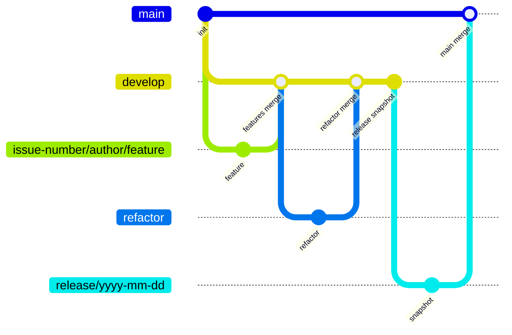

# TEAM2_BE

## Maintainers

## Table of Contents

[Git Convention](#git-convention) 
[Code Convention](#code-convention) 
[Project Structure](#project-structure) 

## Git Convention

### Branch

#### Flow

#### Branch list

- `main`
  - snapshot branch에서 merge
- `develop`
  - 주차별 업데이트 코드
- `release/yyy-mm-dd`
  - release snapshot
- `refactor/*`
  - 코드 리팩토링 브랜치
- `issue-number/author/feature`
  - 기능 개발 브랜치
  - 이슈번호/작성자/작업내용(간략히)
  - 예시
    - `BTSK-1/flareseek/social_login`

#### Branch Rules

##### develop, main

- creations, updates, deletions 제한
- PR로만 merge 가능
- 2명 이상의 리뷰어 승인 필요
- PR 승인 후 커밋이 발생하면 다시 승인 필요
- status check 통과 필요

#### Commit meesage

- 50자 이내로 작성해주세요. 그 외에 정해진 규칙은 없습니다.
- 아래 예시를 참고하여 커밋 의미를 명확히 전달해주세요.

예시

- `feat: 카카오 로그인 구현` (Good)
- `Add Kakao login api` (Good)
- ~~`fix: bug fix`~~(Bad)
- ~~`api 추가`~~ (Bad)

#### PR

- 제목: `이슈번호: 작업내용(명확히)`
- 본문: template에 맞게 작성

예시

- `BTSK-1: 소셜 로그인 및 소셜 회원가입` (Good)
- ~~`BTSK-1: 기능 추가`~~ (Bad)

## Code Convention

- [Google Java Style Guide](https://google.github.io/styleguide/javaguide.html)

## Project Structure

TBD
