

  <h1 align="center">Pullit</h1>
  <h3> [ 🏆 최우수상 ] </h3>
  <h3> AI 기반 자동 문제 생성 및 학습 플랫폼</h3>
  

    <strong>학습 자료를 업로드하면 AI가 똑똑하게 문제를 만들어 드립니다.</strong>
     
    <em>지루한 학습 준비 과정을 끝내고, 진짜 '공부'에 집중하세요.</em>
  

 

---

## 가이드

저희 프로젝트는 main 브랜치가 아닌 develop를 기준으로 코드를 확인해주시면 됩니다.

## 🔗 바로가기 (Links)

- **배포 URL**: [https://portfolio.yeon.world/pull-it](https://portfolio.yeon.world/pull-it)
- **프로젝트 문서 및 API 명세**: [https://portfolio.yeon.world/pull-it/docs](https://portfolio.yeon.world/pull-it/docs)
- **팀 노션 페이지**: [https://www.notion.so/2-245c61d733498000a869fc6fb977d52e](https://www.notion.so/2-245c61d733498000a869fc6fb977d52e)

- **운영 API 서버**: [https://portfolio.yeon.world/pull-it/api](https://portfolio.yeon.world/pull-it/api)
  - **OpenAPI 원본**: [https://portfolio.yeon.world/pull-it/api-docs](https://portfolio.yeon.world/pull-it/api-docs)
- 기존 QA 전용 Prometheus, Grafana, RabbitMQ 공개 주소는 이번 포트폴리오
  복구 범위에 포함하지 않습니다. 복구 환경의 상태는 Docker Compose
  healthcheck와 Spring Actuator로 확인합니다.

---

## 📖 목차

- [**소개 (Why Pullit?)**](#-why-pullit--왜-pullit을-만들었나요)
- [**주요 기능 (Key Features)**](#-key-features--pullit의-핵심-기능)
- [**기술 스택 (Tech Stack)**](#️-tech-stack--pullit을-움직이는-기술들)
- [**시스템 아키텍처 (Architecture)**](#-architecture--시스템-아키텍처)
- [**시스템 모니터링 (Monitoring)**](#-monitoring--시스템-모니터링)
- [**데이터베이스 ERD (Database ERD)**](#-database-erd--데이터-구조)
- [**팀원 소개 (Team)**](#-team--pullit을-만든-사람들)

---

## 🧐 Why Pullit? | 왜 Pullit을 만들었나요?

> "공부를 위해 요약, 정리, 문제 제작에 시간을 쏟고 계신가요?"

**Pullit**은 학습 자료(PDF, 텍스트 등)를 AI 문제집으로 자동 변환하는 학습 플랫폼입니다.
문제 풀이와 오답 노트로 스마트하게 학습하세요.

---

## ✨ Key Features | Pullit의 핵심 기능

### 1. 문제 생성
> 학습 자료(PDF 등)를 올리면 Gemini AI가 다양한 유형의 문제를 자동으로 생성합니다.

| 기능 미리보기 (PC) | 기능 미리보기 (Mobile) |
| :---: | :---: |
|  | 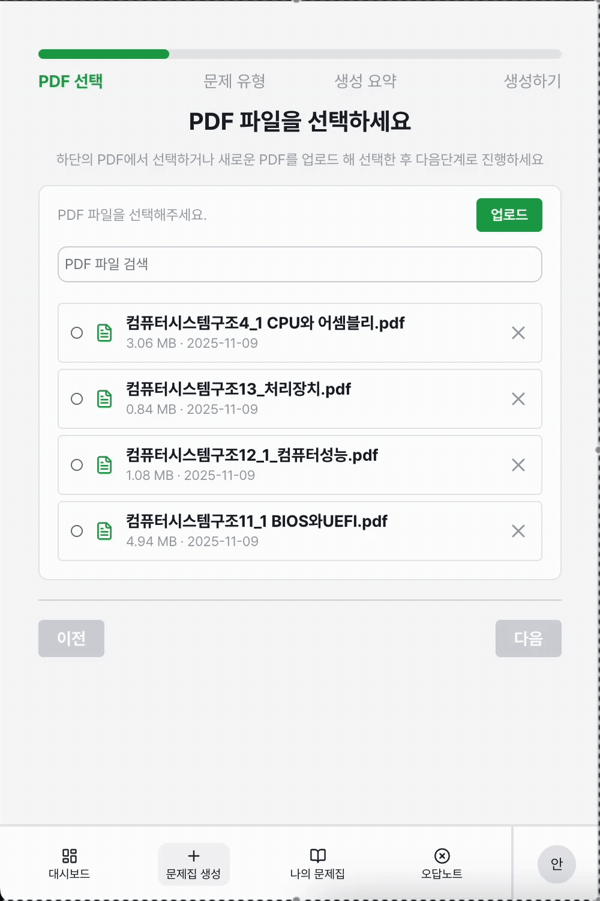 |

---

### 2. 문제 풀이
> 생성된 문제를 풀고 즉시 채점하며 상세한 해설을 확인할 수 있습니다.

| 기능 미리보기 (PC) | 기능 미리보기 (Mobile) |
| :---: | :---: |
| 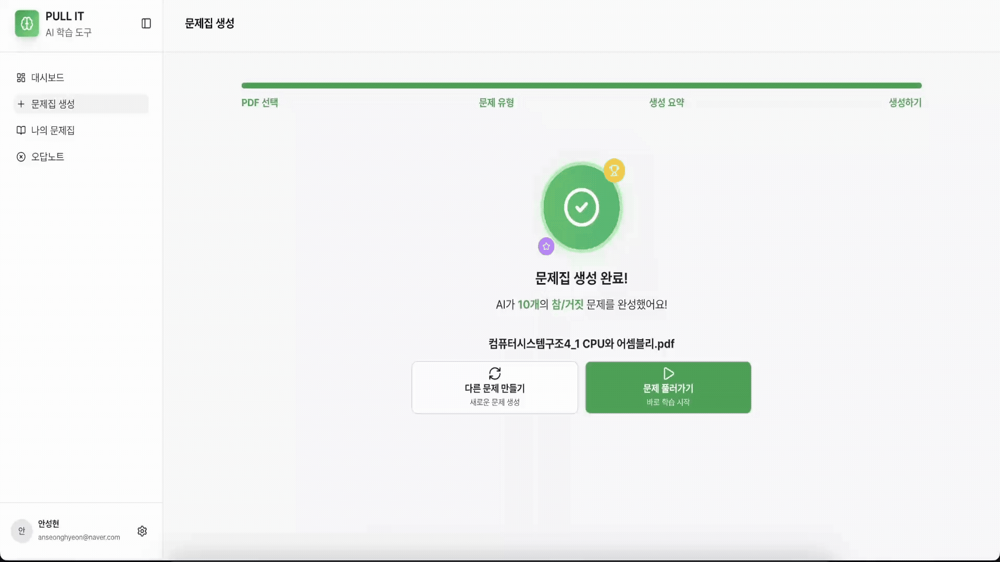 | 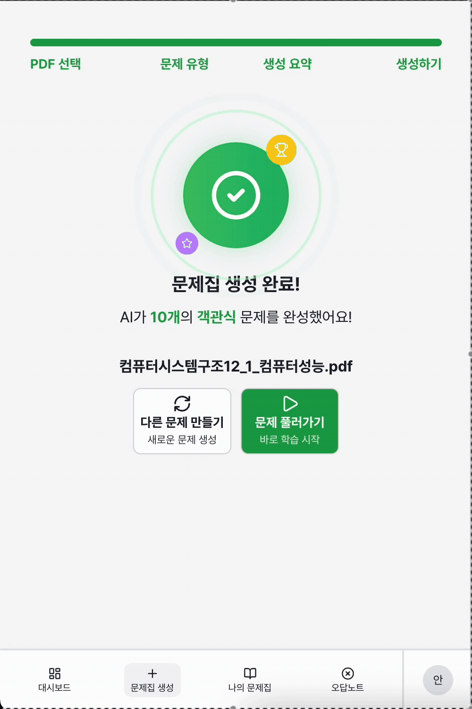 |

---

### 3. 문제 관리
> 생성된 문제집과 학습 자료를 폴더별로 효율적으로 관리할 수 있습니다.

| 기능 미리보기 (PC) | 기능 미리보기 (Mobile) |
| :---: | :---: |
|  | 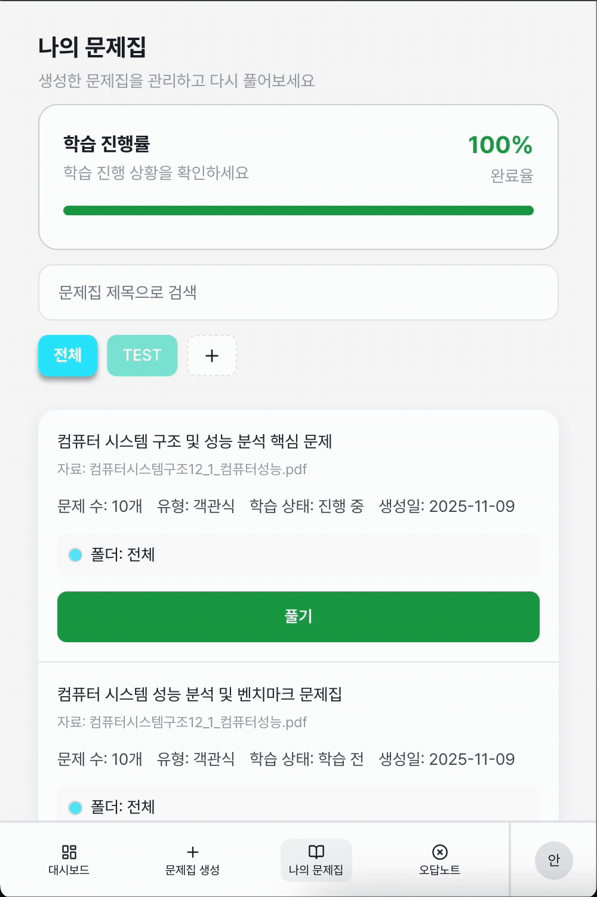 |

---

### 4. 오답 노트
> 틀린 문제는 자동으로 오답 노트에 기록되어 취약점을 집중적으로 학습할 수 있습니다.

| 기능 미리보기 (PC) | 기능 미리보기 (Mobile) |
| :---: | :---: |
| 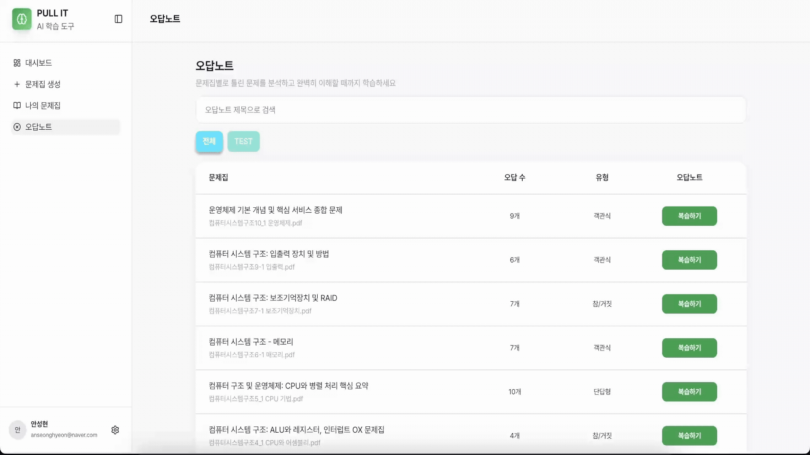 | 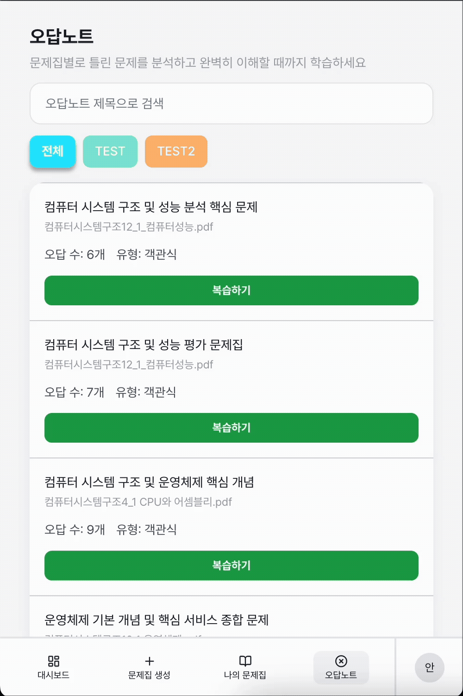 |

---

### 5. 대시보드
> 학습 현황과 성과를 통계로 시각화하여 학습 동기를 부여합니다.

| 기능 미리보기 (PC) | 기능 미리보기 (Mobile) |
| :---: | :---: |
| 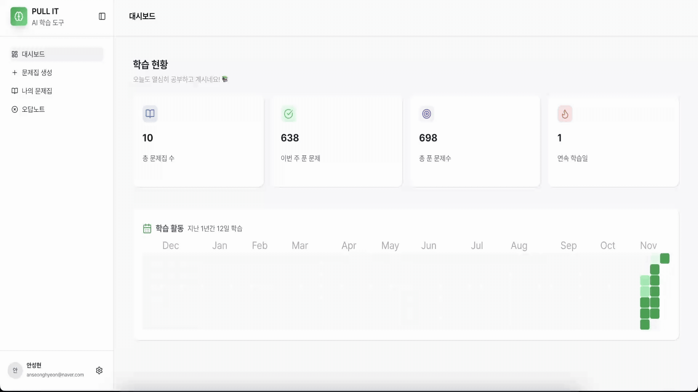 |  |

---

### 6. 알림
> 문제집 생성이 완료되거나 중요한 학습 활동이 있을 때 실시간 알림을 받습니다.

| 기능 미리보기 1 |
| :---: |
| 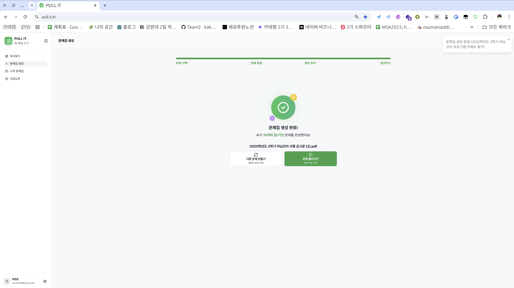 |

---

## 🛠️ Tech Stack | Pullit을 움직이는 기술들

| 구분 | 기술 스택 |
| :--- | :--- |
| **Core Backend** |    |
| **Data Layer** |    |
| **Infra & DevOps** |      |
| **Async & Monitoring** |     |
| **AI & External** |   |

---

## 🏗️ Architecture | 시스템 아키텍처

Pullit은 안정적인 서비스 제공을 위해 API 서버와 백그라운드 작업을 처리하는 Worker 서버를 분리했으며, 메시지 큐를 통해 비동기 처리를 구현하고 무중단 배포 파이프라인을 구축했습니다.

백엔드는 도커 컴포즈를 통해 아래와 같이 9종류의 가상 서버를 운영합니다.
- **Nginx**: 리버스 프록시 및 로드 밸런서
- **Pullit API Server (Blue/Green)**: 메인 애플리케이션 서버
- **Pullit Worker Server (Blue/Green)**: AI 문제 생성 등 비동기 작업을 처리하는 서버
- **MariaDB**: 메인 데이터베이스
- **Redis**: Refresh Token을 관리하는 캐시 저장소
- **RabbitMQ**: 메시지 큐
- **Prometheus**: 메트릭 수집 서버
- **Grafana**: 모니터링 대시보드
- **Node Exporter**: OS 및 하드웨어 메트릭 수집

아키텍처 다이어그램 및 설명 보기

    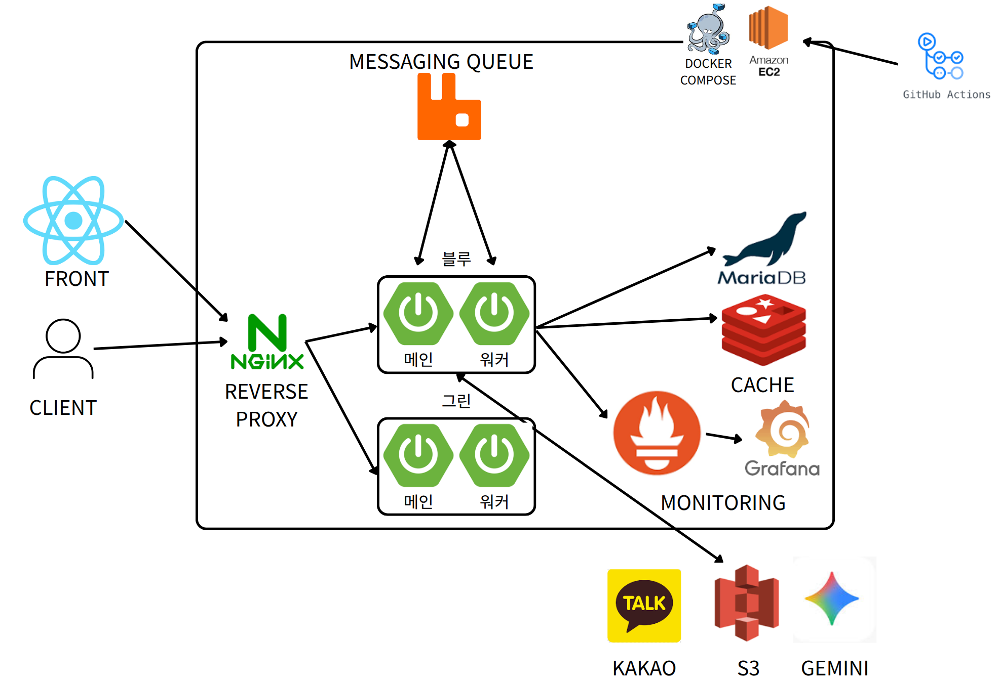

| 구성 요소 | 설명 |
|:---|:---|
| **리버스 프록시** | **Nginx**를 통해 SSL 종료, 로드 밸런싱, 요청 라우팅을 담당합니다.   🕵️ *관련 경로: [Nginx 설정 문서](https://portfolio.yeon.world/pull-it/docs/#05-deploy-nginx)* |
| **애플리케이션 서버** | **Spring Boot** 기반의 API 서버와 Worker 서버를 분리 운영합니다. 무거운 작업을 Worker에게 위임하여 API 서버의 안정성을 확보했으며, 핵심 설계 원칙은 하단에 별도로 기술했습니다.   🕵️ *관련 경로: `docker-compose.qa.yml`* |
| **데이터 & 캐시** | 영구 데이터는 **MariaDB**에 저장하며, **Redis**는 **리프레시 토큰 관리** 및 캐시 데이터 저장에 사용하여 성능을 최적화합니다.   🕵️ *관련 경로: `RedisConfig.java`, `AuthService.java`, `RefreshTokenRepository.java`* |
| **비동기 처리** | **RabbitMQ**를 도입하여 대용량 파일 업로드 시 발생하던 메모리 부족 문제를 해결했습니다. 요청을 즉시 처리하는 대신 큐에 등록하고 Worker가 순차 처리하여 시스템 안정성을 확보했습니다. 특히 **학습 성과 대시보드**의 경우, **트랜잭션 아웃박스 패턴**을 통해 데이터 정합성을 보장함과 동시에 통계 집계 시 발생할 수 있는 **예상 성능 저하를 선제적으로 해결**했습니다. 다만, 메세지 큐가 도입되기 전 일부 로직에서 여전히 내장 `ApplicationEventPublisher`를 사용하고 있기도 합니다.   🕵️ *관련 경로: `RabbitMqConfig.java`, `QuestionGenerationEventHandler.java`, `QuestionGenerationWorker.java`* |
| **CI/CD** | **GitHub Actions**를 통해 **블루/그린 무중단 배포** 파이프라인을 구축했습니다. Nginx를 통해 트래픽을 전환하여, 사용자는 서비스 중단 없이 새로운 기능을 안정적으로 제공받을 수 있습니다.   🕵️ *관련 경로: `.github/workflows/ci.yml`, `.github/workflows/cd.yml`* |
| **외부 서비스** | Google Gemini(AI)와 통신 시, 명확한 JSON 응답 스키마를 정의하고 검증하여 비정형적인 응답에 안정적으로 문제를 생성하도록 구현했습니다. 그 외 **Kakao(OAuth)**, **AWS S3(파일 스토리지)** 와 통신합니다.   🕵️ *관련 경로: `GeminiConfigBuilder.java`, `GeminiClient.java`, `QuestionService.java`, `S3FileStorageClientManagingClient.java`, `CustomOAuth2UserService.java`, `KakaoPrincipal.java`* |

#### 📦 그 외 살펴볼 클래스

Pullit의 아키텍처와 비즈니스 로직을 빠르게 파악하고 싶으시다면, 아래 파일들을 먼저 살펴보시는 것을 추천합니다.

- **인증 및 보안 (Authentication & Security)**
  - `kr.it.pullit.platform.security.config.SecurityConfig`: JWT와 OAuth2를 포함한 전체적인 Spring Security 설정의 중심입니다.
  - `kr.it.pullit.platform.security.jwt.filter.JwtAuthenticationFilter`: 모든 API 요청의 JWT 토큰을 검증하는 필터입니다.
  - `kr.it.pullit.modules.auth.kakaoauth.service.CustomOAuth2UserService`: 카카오 소셜 로그인 성공 후 사용자 정보를 처리합니다.
  - `kr.it.pullit.platform.security.handler.OAuth2AuthenticationSuccessHandler`: OAuth2 인증 성공 후 토큰 발급 및 리다이렉션을 처리하는 핸들러입니다.
  - `kr.it.pullit.platform.security.repository.OAuth2AuthorizationRequestRepository`: OAuth2 인증 요청 과정에서 상태(state)와 리다이렉션 URI를 임시 저장합니다.

- **AI 문제 생성 (AI Question Generation)**
  - `kr.it.pullit.modules.questionset.service.QuestionSetService`: 문제집 생성 요청을 접수하고 전체 흐름을 관리합니다.
  - `kr.it.pullit.modules.questionset.event.QuestionGenerationWorker`: RabbitMQ로부터 이벤트를 받아 실제 AI 문제 생성을 비동기적으로 처리하는 워커입니다.
  - `kr.it.pullit.modules.questionset.client.GeminiClient`: Google Gemini AI 모델과 통신하여 문제를 생성하는 클라이언트입니다.

- **문제 채점 및 통계 (Marking & Statistics)**
  - `kr.it.pullit.modules.questionset.service.MarkingService`: 사용자가 제출한 답안을 채점하는 핵심 로직을 담고 있습니다.
  - `kr.it.pullit.modules.questionset.event.MarkingCompletedEvent`: 채점이 완료된 후 발행되는 동기 이벤트입니다.
  - `kr.it.pullit.modules.wronganswer.service.WrongAnswerEventListener`: `MarkingCompletedEvent`를 받아 오답 노트를 생성합니다.
  - `kr.it.pullit.modules.projection.learnstats.event.handler.LearnStatsEventDispatcher`: `MarkingCompletedEvent`를 받아 학습 통계를 업데이트합니다.

- **학습 자료 및 파일 관리 (Learning Source & File Management)**
  - `kr.it.pullit.modules.learningsource.source.service.SourceService`: 학습 자료(PDF 등) 업로드 및 상태 관리를 담당합니다.
  - `kr.it.pullit.platform.storage.client.S3FileStorageClientManagingClient`: AWS S3와의 파일 통신을 담당하는 클라이언트입니다.

- **공통 및 기반 구조 (Common & Platform)**
  - `kr.it.pullit.shared.error.GlobalExceptionHandler`: 프로젝트 전역의 예외를 처리하여 일관된 오류 응답을 제공합니다.
  - `kr.it.pullit.shared.jpa.BaseEntity`: 모든 엔티티가 공통으로 상속받는 기본 엔티티 클래스입니다.

---

## 📊 Monitoring & Infrastructure | 시스템 모니터링 & 인프라

Pullit은 블루/그린 배포 환경에서 메인 API 서버(Blue/Green)와 문제 생성 워커 서버(Blue/Green), 총 4개의 핵심 서버 그룹에 대한 실시간 모니터링을 수행합니다.

모니터링 시스템 구성 보기

    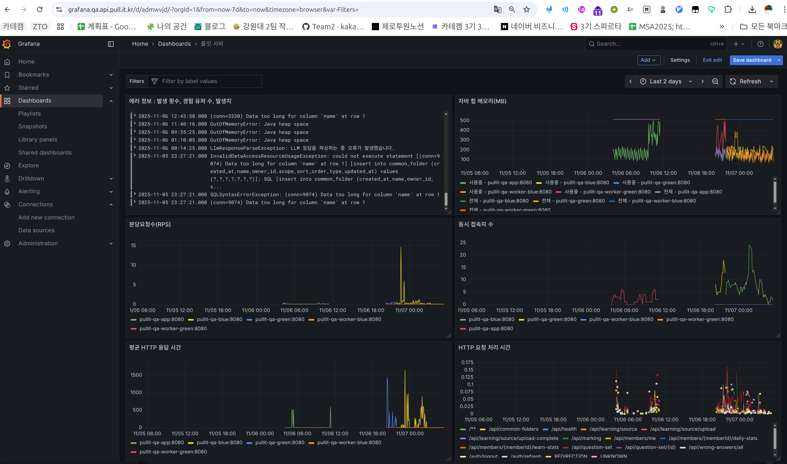
    
<em>Grafana 대시보드를 통한 실시간 서버 지표 모니터링</em>

    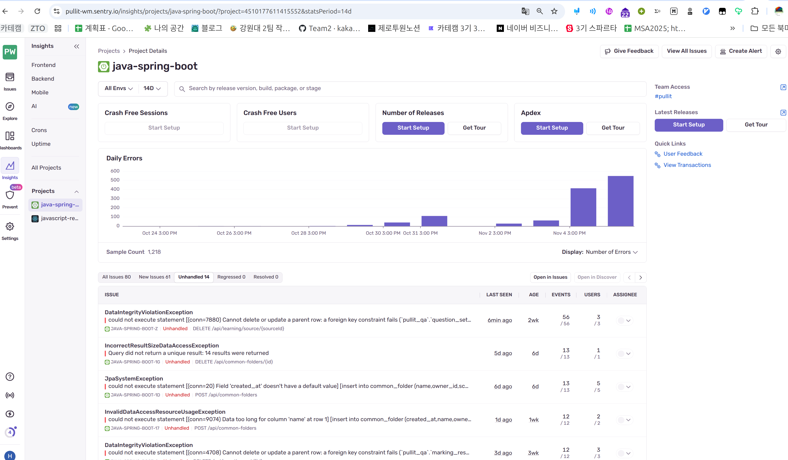
    
<em>Sentry를 이용한 실시간 에러 트래킹 및 분석</em>

| 구성 요소 | 설명 |
|:---|:---|
| **Prometheus** | Spring Actuator와 Micrometer를 통해 애플리케이션의 JVM, CPU, API 응답 시간 등 다양한 지표를 수집합니다. |
| **Grafana** | Prometheus가 수집한 데이터를 시각화하여 시스템 상태를 한눈에 파악할 수 있는 대시보드를 제공합니다. |
| **Sentry** | 실시간으로 발생하는 애플리케이션 에러를 수집하고 분석하여 개발자에게 알림을 보내는 에러 트래킹 시스템입니다. |

 

| 감시 지표 | 수집 방법 | 감시 목적 |
|:---|:---|:---|
| **JVM 지표 (Heap Memory, CPU 사용률)** | Spring Actuator를 통해 JVM 지표를 노출하고, Micrometer를 거쳐 Prometheus가 수집합니다. | 메모리 누수/CPU 과부하 감지로 안정성을 확보하고 리소스 증설 계획에 활용합니다. |
| **API 성능 (RPS, 응답 시간)** | Micrometer가 `http_server_requests` 메트릭을 URI, HTTP 메서드, 상태 코드별로 수집합니다. | API별 요청/응답 시간 추적으로 성능 병목을 식별하고 UX 저하를 방지합니다. |
| **DB 커넥션 풀 & 슬로우 쿼리** | HikariCP 커넥션 풀의 상태(Active, Idle 등)를 Micrometer로 추적하고, MariaDB의 슬로우 쿼리 로그를 모니터링합니다. | DB 커넥션 고갈 장애를 예방하고, 성능 저하를 유발하는 쿼리를 찾아 최적화합니다. |
| **실시간 에러** | Sentry SDK를 애플리케이션에 연동하여 처리되지 않은 예외나 명시적으로 기록한 에러를 실시간으로 수집합니다. | 운영 환경의 버그를 실시간으로 인지하고, 스택 분석으로 신속히 원인을 파악 및 대응합니다. |
| **동시 접속자 수** | 로그인 세션 수나 SSE 연결 수 등을 커스텀 메트릭으로 정의하여 Micrometer를 통해 수집합니다. | 동시 사용자 수 파악으로 시스템 부하를 예측하고, 트래픽 급증에 대비해 확장 전략을 수립합니다. |

---

## 🗺️ Database ERD | 데이터 구조

사용자, 학습 자료, 문제, 풀이 결과 등 서비스의 핵심 데이터를 관리하는 테이블 구조와 관계를 정의합니다.

ERD 다이어그램 및 설명 보기

    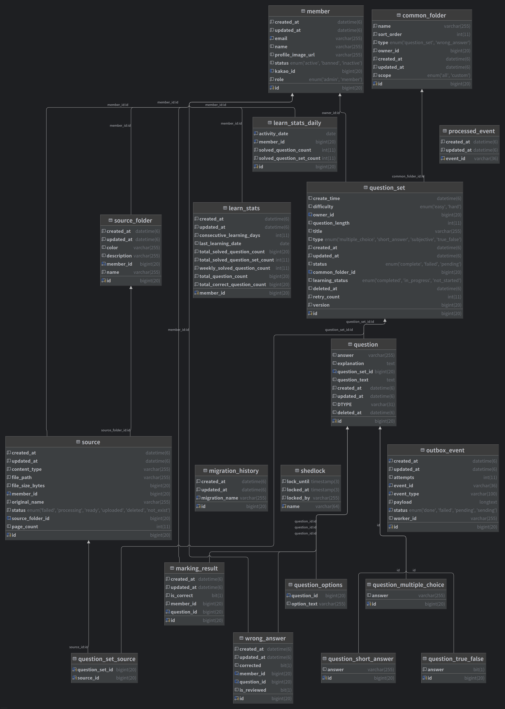

| 테이블 | 설명 |
|:---|:---|
| **Member** | 카카오 소셜 로그인을 통해 가입한 사용자 정보를 저장합니다. |
| **Source / SourceFolder** | 사용자가 업로드한 학습 자료(Source)와 이를 관리하는 폴더 정보를 저장합니다. |
| **QuestionSet / Question**| AI가 생성한 문제집(QuestionSet)과 개별 문제(Question) 정보를 관리합니다. |
| **QuestionXXX subtypes** | 문제 유형별(객관식, 단답형 등) 추가 정보와 선택지(`question_options`)를 저장합니다. |
| **QuestionSetSource** | 문제집과 생성에 사용된 학습 자료(Source) 간의 N:M 관계를 매핑합니다. |
| **MarkingResult** | 사용자의 문제 풀이 결과 및 정답 여부를 기록합니다. |
| **WrongAnswer** | 틀린 문제를 저장하여 오답 노트로 활용할 수 있도록 합니다. |
| **LearnStats** | 사용자의 누적 학습 활동(총 푼 문제 수 등)을 집계하여 통계 데이터를 제공합니다. |
| **LearnStatsDaily** | 일별 학습 활동을 기록하여 `LearnStats` 집계의 기반 데이터로 사용됩니다. |
| **CommonFolder** | 문제집, 오답노트 등 다양한 콘텐츠를 관리하는 공용 폴더 구조입니다. |
| **OutboxEvent / ProcessedEvent** | 이벤트 기반 아키텍처에서 데이터 정합성을 보장하기 위해, 발행/수신한 이벤트의 상태와 처리 여부를 관리합니다. (트랜잭셔널 아웃박스 패턴) |
| **ShedLock** | 분산 환경에서 스케줄링 작업이 중복 실행되는 것을 방지하기 위한 잠금(Lock) 정보를 저장합니다. |
| **MigrationHistory** | 데이터베이스 스키마 변경 이력을 관리합니다. |

---

## ✅ Test Coverage | 테스트 커버리지

Jacoco를 사용하여 코드 커버리지를 측정하고 있으며, 총 481개의 테스트 메서드를 통해 **클래스 84%, 메서드 81%, 라인 80%, 브랜치 69%**의 높은 커버리지를 달성하여 코드의 안정성과 신뢰성을 확보합니다.

테스트 커버리지 리포트 보기

    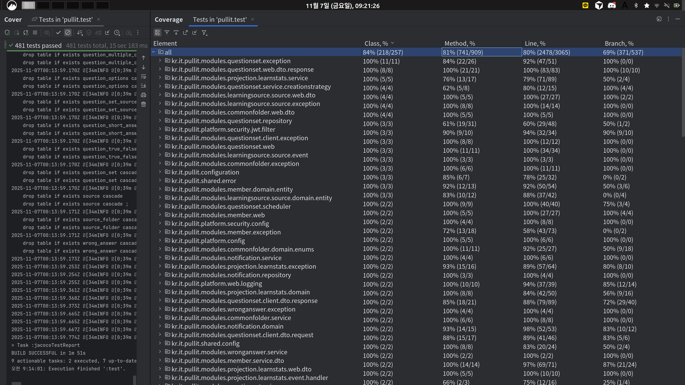
    
<em>Jacoco를 이용한 테스트 커버리지 측정 결과</em>

---

## 📐 Software Design | 주요 설계 원칙

도메인 주도 설계(DDD)와 이벤트 기반 아키텍처를 핵심 원칙으로 삼아, 복잡한 비즈니스 로직을 응집도 높고 유연하게 구현했습니다.

주요 설계 원칙 및 적용 사례 보기

- 도메인 주도 설계(DDD) 
DDD를 적용하여 **풍부한 도메인 모델**을 구축했습니다. 각 도메인 객체가 자신의 비즈니스 정책을 스스로 책임지게 함으로써, 서비스 계층의 복잡도를 낮추고 응집도 높은 코드를 유지했습니다.
- 단일 책임 원칙(SRP) 
클래스와 메서드가 하나의 책임만 갖도록 코드를 분리했습니다. 예를 들어, 복잡했던 `QuestionSetService`의 책임 중 문제 생성 요청, 상태 관리, 재시도 로직 등을 명확히 분리하여, 특정 기능 수정이 다른 부분에 미치는 영향을 최소화하고 코드 변경의 안정성을 높였습니다.
- 도메인 경계 보호 
각 도메인이 다른 도메인의 데이터 저장소(Repository)에 직접 접근하여 경계를 침범하는 것을 엄격히 방지했습니다. 도메인 간 협력이 필요할 때는 **퍼사드(Facade) 패턴**을 통해 필요한 기능만 제한적으로 노출하거나 **이벤트**를 발행하여 간접적으로 통신하는 방식을 적극적으로 활용함으로써 도메인의 독립성을 보장했습니다.
- 이벤트 기반 아키텍처 
도메인 간의 직접적인 의존성을 제거하고 **이벤트**를 통해 상호작용하도록 설계했습니다. 이를 통해 도메인 간 **느슨한 결합**을 유지하여 코드의 확장성과 유지보수성을 크게 향상시켰습니다. Pullit은 작업의 성격에 따라 아래와 같이 동기/비동기 이벤트를 전략적으로 활용합니다.
  - **동기 이벤트 (In-process)**: **문제 채점**처럼 즉각적인 처리가 중요한 작업에 사용됩니다. 동일 프로세스 내에서 후속 작업을 바로 실행하여 데이터 정합성을 보장합니다.
  - **비동기 이벤트 (Message Queue)**: **AI 문제 생성**같이 오래 걸리는 작업은 메시지 큐를 통해 백그라운드에서 처리합니다. 이를 통해 사용자에게 빠른 응답을 제공하고 시스템 안정성을 높입니다.

<b>예시 1: 동기 작업에서의 이벤트 흐름 (문제 채점)</b>

사용자가 제출한 답안을 채점하고, 그 결과에 따라 오답 노트를 생성하고 학습 통계를 즉시 업데이트하는 동기적 흐름을 보여줍니다.

1.  **채점 요청**: 사용자가 문제 풀이를 완료하고 채점을 요청합니다.
2.  **핵심 로직 처리**: `MarkingService`는 요청을 받아 채점을 수행하고 결과를 데이터베이스에 저장하는 핵심 책임을 완수합니다.
3.  **이벤트 발행**: `MarkingService`는 자신의 일이 끝났음을 알리는 `MarkingCompletedEvent`를 발행합니다.
4.  **후속 처리**: 이벤트를 구독하고 있던 `WrongAnswerEventListener`와 `LearnStatsEventDispatcher`가 즉시 호출되어, 각각 오답 노트를 생성하고 학습 통계를 업데이트합니다. 모든 과정은 하나의 트랜잭션 안에서 순차적으로 일어납니다.

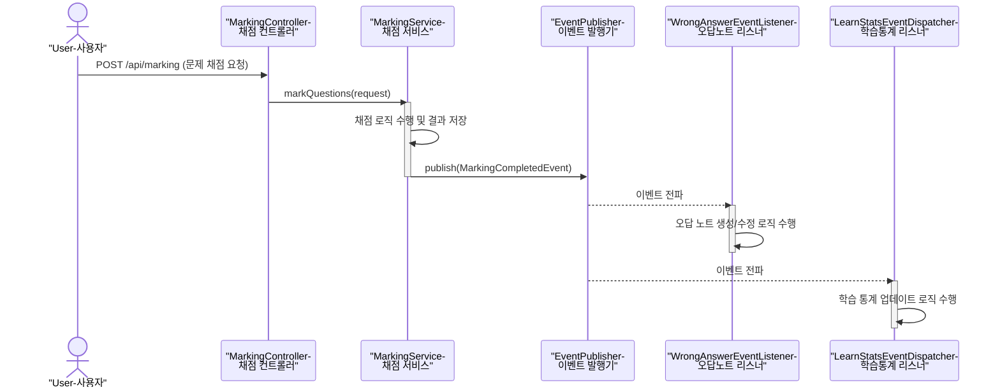
```mermaid
sequenceDiagram
    actor User as "User-사용자"
    participant MarkingController as "MarkingController-<br/>채점 컨트롤러"
    participant MarkingService as "MarkingService-<br/>채점 서비스"
    participant EventPublisher as "EventPublisher-<br/>이벤트 발행기"
    participant WrongAnswerEventListener as "WrongAnswerEventListener-<br/>오답노트 리스너"
    participant LearnStatsEventDispatcher as "LearnStatsEventDispatcher-<br/>학습통계 리스너"

    User->>MarkingController: POST /api/marking (문제 채점 요청)
    MarkingController->>MarkingService: markQuestions(request)
    activate MarkingService

    MarkingService->>MarkingService: 채점 로직 수행 및 결과 저장
    MarkingService->>EventPublisher: publish(MarkingCompletedEvent)
    deactivate MarkingService

    EventPublisher-->>WrongAnswerEventListener: 이벤트 전파
    activate WrongAnswerEventListener
    WrongAnswerEventListener->>WrongAnswerEventListener: 오답 노트 생성/수정 로직 수행
    deactivate WrongAnswerEventListener

    EventPublisher-->>LearnStatsEventDispatcher: 이벤트 전파
    activate LearnStatsEventDispatcher
    LearnStatsEventDispatcher->>LearnStatsEventDispatcher: 학습 통계 업데이트 로직 수행
    deactivate LearnStatsEventDispatcher
```

<b>예시 2: 비동기 작업에서의 이벤트 흐름 (AI 문제 생성)</b>

사용자의 문제 생성 요청을 메시지 큐에 전달하여 즉시 응답하고, 별도의 워커가 백그라운드에서 AI 모델과 통신하여 문제를 생성하는 비동기적 흐름을 보여줍니다.

1.  **요청 접수 및 이벤트 발행**: 사용자가 문제 생성을 요청하면, `EventHandler`는 무거운 작업을 직접 처리하는 대신 `QuestionSetCreatedEvent`를 메시지 큐(`RabbitMQ`)에 발행하고 즉시 사용자에게 "접수 완료" 응답을 보냅니다.
2.  **비동기 처리 시작**: 메시지 큐는 이벤트를 대기하고 있던 별도의 `GenerationWorker`에게 작업을 전달합니다.
3.  **AI 문제 생성**: `Worker`는 원본 파일(`S3`)을 다운로드하고, AI 클라이언트(`LLM`)를 호출하여 시간이 오래 걸리는 문제 생성 작업을 수행합니다.
4.  **결과 저장 및 정리**: AI로부터 생성된 문제를 받으면, `Worker`는 이를 데이터베이스에 저장하고 문제집 상태를 '완료'로 변경한 후 임시 파일을 정리하며 모든 과정을 마칩니다.

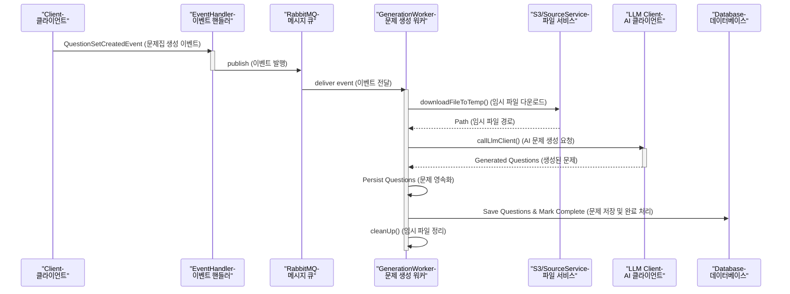
```mermaid
sequenceDiagram
    participant Client as "Client-<br/>클라이언트"
    participant Handler as "EventHandler-<br/>이벤트 핸들러"
    participant MQ as "RabbitMQ-<br/>메시지 큐"
    participant Worker as "GenerationWorker-<br/>문제 생성 워커"
    participant S3 as "S3/SourceService-<br/>파일 서비스"
    participant LLM as "LLM Client-<br/>AI 클라이언트"
    participant DB as "Database-<br/>데이터베이스"

    Client->>Handler: QuestionSetCreatedEvent (문제집 생성 이벤트)
    activate Handler
    Handler->>MQ: publish (이벤트 발행)
    deactivate Handler

    MQ->>Worker: deliver event (이벤트 전달)
    activate Worker

    Worker->>S3: downloadFileToTemp() (임시 파일 다운로드)
    S3-->>Worker: Path (임시 파일 경로)

    Worker->>LLM: callLlmClient() (AI 문제 생성 요청)
    activate LLM
    LLM-->>Worker: Generated Questions (생성된 문제)
    deactivate LLM

    Worker->>Worker: Persist Questions (문제 영속화)
    Worker->>DB: Save Questions & Mark Complete (문제 저장 및 완료 처리)

    Worker->>Worker: cleanUp() (임시 파일 정리)
    deactivate Worker
```

---

## 🚀 Onboarding | 온보딩 문서

새로운 팀원이 프로젝트에 빠르게 적응하고 기여할 수 있도록 체계적인 온보딩 문서를 마련했습니다. 프로젝트의 아키텍처, 개발 컨벤션, 배포 프로세스 등을 상세히 기술한 **[가이드 문서 및 API 명세서](https://portfolio.yeon.world/pull-it/docs)**를 제공하여 학습 비용을 줄이고 원활한 협업을 지원합니다.

---

## 👥 Team | Pullit을 만든 사람들

### Backend
<table width="600px">
    <thead>
    </thead>
    <tr>
        <th>Role</th>
        <td align="center">Team Member</td>
        <td align="center">Team Leader</td>
        <td align="center">Backend Leader</td>
    </tr>
    <tr>
        <th>Picture</th>
        <td align="center"></td>
        <td align="center"></td>
        <td align="center"></td>
    </tr>
    <tr>
        <th>Name</th>
        <td align="center">xqqldir</td>
        <td align="center">Hyeonjun0527</td>
        <td align="center">flareseek</td>
    </tr>
    <tr>
        <th>GitHub</th>
        <td align="center"></td>
        <td align="center"></td>
        <td align="center"></td>
    </tr>
</table>

### Frontend
<table width="600px">
    <thead>
    </thead>
    <tr>
        <th>Role</th>
        <td align="center">Team Member</td>
        <td align="center"><strong>Frontend Leader</strong></td>
    </tr>
    <tr>
        <th>Picture</th>
        <td align="center"></td>
        <td align="center"></td>
    </tr>
    <tr>
        <th>Name</th>
        <td align="center">안성현</td>
        <td align="center">조창희</td>
    </tr>
    <tr>
        <th>GitHub</th>
        <td align="center"></td>
        <td align="center"></td>
    </tr>
</table>
