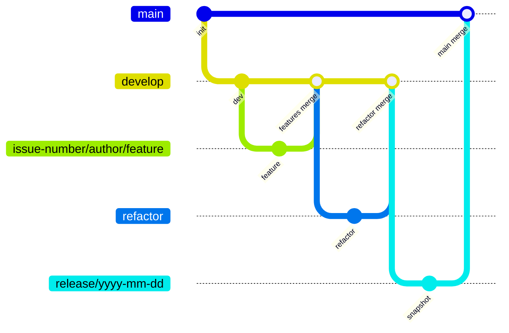

# TEAM2_BE

## Maintainers

## Table of Contents

[Git Convention](#git-convention) 
[Code Convention](#code-convention) 
[Project Structure](#project-structure) 

## Git Convention

### Branch

#### Flow

#### Branch list

- `main`
  - snapshot branch에서 merge
- `develop`
  - 주차별 업데이트 코드
- `release/yyy-mm-dd`
  - release snapshot
- `refactor/*`
  - 코드 리팩토링 브랜치
- `author/issue-number/type-subject`
  - 기능 개발 브랜치
  - 예시
    - `flareseek/BTSK-1/feat-social-login`

#### Branch Rules

##### develop, main

- creations, updates, deletions 제한
- PR로만 merge 가능
- 1명 이상의 리뷰어 승인 필요
- PR 승인 후 커밋이 발생하면 다시 승인 필요
- status check 통과 필요

#### Commit meesage

- `type: subject`
- 50자 이내로 subject 작성

- 예시
  - `feat: 카카오 로그인 구현` (Good)
  - ~~`fix: bug fix`~~(Bad)
  - ~~`api 추가`~~ (Bad)

#### Type Convention

| Type         | Description                                              |
| ------------ | -------------------------------------------------------- |
| **feat**     | 새로운 기능 추가                                         |
| **fix**      | 버그 수정                                                |
| **docs**     | 문서 수정                                                |
| **style**    | 코드 스타일 변경 (들여쓰기, 세미콜론 등; 기능 변경 없음) |
| **refactor** | 기능 변경 없는 코드 리팩토링                             |
| **test**     | 테스트 코드 추가 또는 수정                               |
| **chore**    | 빌드, 패키지 매니저 설정 등 (기타 잡일)                  |
| **hotfix**   | 급하게 배포해야 하는 치명적인 버그 수정                  |

#### PR

- 제목: `이슈번호: 작업내용(명확히)`
- 본문: template에 맞게 작성
- merge시 squash 사용 (제목이 commit message가 됨)

예시

- `BTSK-1: 소셜 로그인 및 소셜 회원가입` (Good)
- ~~`BTSK-1: 기능 추가`~~ (Bad)

## Code Convention

- [Google Java Style Guide](https://google.github.io/styleguide/javaguide.html)

## Project Structure

TBD
